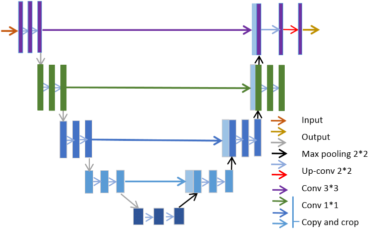
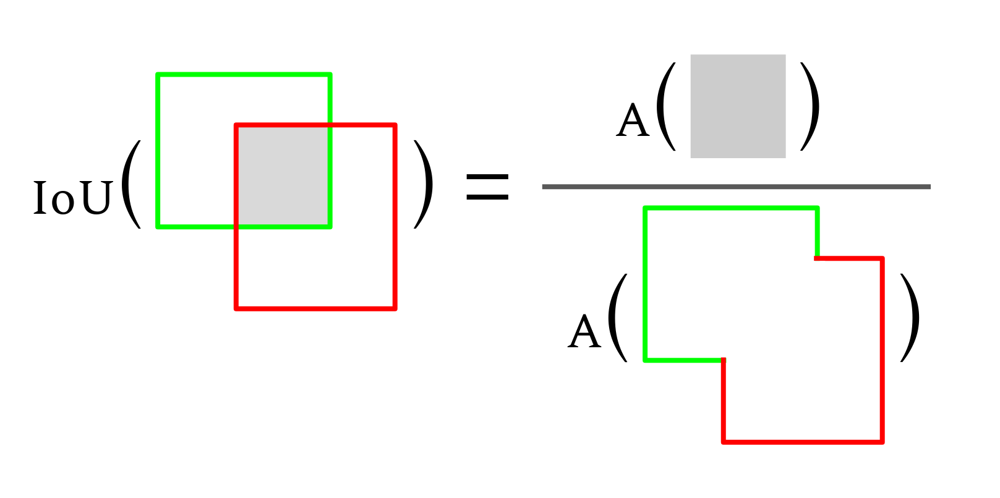
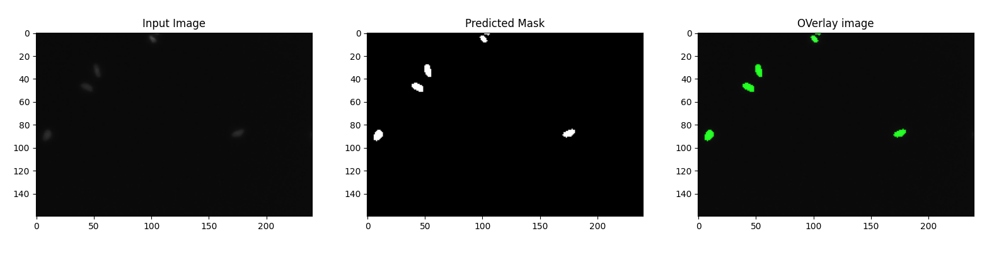

# UNet Implementation for Semantic Segmentation

[Handwritten notes](https://drive.google.com/file/d/1LFzzrHczVCVWX7pMJoVUY-8Ye76rd0sq/view?usp=sharing)
 
## Table of Contents
1. [Introduction](#introduction)
2. [UNet Architecture](#unet-architecture)
   - [Down Convolution (Encoder)](#down-convolution-encoder)
   - [Up Convolution (Decoder)](#up-convolution-decoder)
   - [Concatenation](#concatenation)
3. [Loss Functions](#loss-functions)
4. [Metrics: IOU and Jaccard Index](#metrics-iou-and-jaccard-index)
5. [Results](#results)
6. [Sample Bash Commands](#sample-bash-commands)
7. [References](#references)

## Introduction
In this project, I implemented a UNet model for semantic segmentation. The UNet architecture is particularly well-suited for biomedical image segmentation due to its symmetric structure, which consists of an encoder (downsampling path) and a decoder (upsampling path). The architecture captures context while providing precise localization by combining feature maps from different resolutions.

## UNet Architecture




### Down Convolution (Encoder)
The encoder path of the UNet consists of several convolutional blocks, each followed by a max-pooling layer. These blocks progressively reduce the spatial dimensions while increasing the depth of the feature maps, capturing more complex features as we go deeper.

#### Code Snippet
```python
class Downs(nn.Module):
    def __init__(self, in_channels, out_channels):
        super().__init__()
        self.conv = DoubleConv(in_channels, out_channels)
        self.pool = nn.MaxPool2d(kernel_size=2, stride=2)

    def forward(self, x):
        down_conv = self.conv(x)
        down_pool = self.pool(down_conv)
        return down_conv, down_pool
```

#### Explanation
- `DoubleConv` applies two sequential convolutional layers, each followed by batch normalization and ReLU activation. This helps in learning complex features.
- `MaxPool2d` reduces the spatial dimensions by half, retaining only the most critical information, which helps in reducing computation and capturing the larger context of the image.

### Up Convolution (Decoder)
The decoder path aims to reconstruct the image to its original dimensions by upsampling the feature maps using transpose convolutions and concatenating them with corresponding encoder feature maps.

#### Code Snippet
```python
class Ups(nn.Module):
    def __init__(self, in_channels, out_channels):
        super().__init__()
        self.up = nn.ConvTranspose2d(in_channels, in_channels // 2, kernel_size=2, stride=2)
        self.conv = DoubleConv(in_channels, out_channels)

    def forward(self, x1, x2):
       x1 = self.up(x1)
       x = torch.cat([x1, x2], 1)
       return self.conv(x)
```

#### Explanation
- `ConvTranspose2d` performs the upsampling, increasing the spatial dimensions by a factor of 2. This process is often referred to as "deconvolution" or "transpose convolution".
- `torch.cat` concatenates the upsampled feature map with the corresponding feature map from the encoder. This concatenation helps in retaining high-resolution features from the encoder path, which are crucial for precise localization.

### Concatenation
Concatenation in UNet is a key step that merges the upsampled features from the decoder with the high-resolution features from the encoder. This helps in combining contextual information from deeper layers with fine-grained details from earlier layers.

#### Code Snippet
```python
def forward(self, x1, x2):
   x1 = self.up(x1)
   x = torch.cat([x1, x2], 1)
   return self.conv(x)
```

#### Explanation
- The upsampled feature map `x1` from the decoder is concatenated with the corresponding feature map `x2` from the encoder.
- The concatenated feature map is then passed through a `DoubleConv` block to refine the features.

## Loss Functions
For training the UNet model, I used the Binary Cross-Entropy with Logits Loss, which is suitable for binary segmentation tasks.

```python
loss_fn = nn.BCEWithLogitsLoss()
```

The binary cross-entropy with logits loss function is defined as:

```math
\text{BCEWithLogitsLoss}(x, y) = -\frac{1}{N} \sum_{i=1}^{N} \left[ y_i \cdot \log(\sigma(x_i)) + (1 - y_i) \cdot \log(1 - \sigma(x_i)) \right]
```

## Metrics: IOU and Jaccard Index
### IOU (Intersection over Union)
The Intersection over Union (IOU) is a metric used to evaluate the accuracy of an object detector on a particular dataset. The IOU is defined as the area of overlap between the predicted segmentation and the ground truth divided by the area of their union.

```math
IOU = \frac{TP}{TP + FP + FN}
```



## Results
Here are the results of the segmentation task. The following images show the input image, the predicted mask, and an overlay of the predicted mask on the input image.



## Sample Bash Commands
### Training the Model
```bash
python train.py --num_epochs 20 --batch_size 4 --learning_rate 0.001 --train_dir ./microscope_data/train --test_dir ./microscope_data/validation
```

### Running Inference
```bash
python inference.py --image_path ./microscope_data/validation/0b0d577159f0d6c266f360f7b8dfde46e16fa665138bf577ec3c6f9c70c0cd1e/images/0b0d577159f0d6c266f360f7b8dfde46e16fa665138bf577ec3c6f9c70c0cd1e.png --model_path ./models/final.pth.tar
```
